# pretty-readme
# 📚 Мой Проект: Документация с Примерами

---

## 📌 Навигатор по проекту
- [Описание проекта](#описание-проекта)
- [Особенности](#особенности)
- [Документация](#документация-📄)
- [Пример кода](#пример-кода-💻)
- [Сравнение с аналогами](#сравнение-с-аналогами-📊)
- [Архитектура](#архитектура-🏗️)
- [Контакты](#контакты)

---

## 🎯 Описание проекта

**Этот проект** представляет собой *полноценную демонстрацию* использования `Markdown`-разметки для создания качественной документации. Он включает в себя **все необходимые элементы** для удобного представления информации о любом IT-проекте.

> *"Хорошая документация — это половина успеха проекта"* — Народная мудрость

---

## ✨ Особенности

### ✅ Поддерживаемые функции:
1. Полная Markdown-разметка
2. Навигация по якорям
3. Визуализация данных
4. Сравнительные таблицы

### 🖼️ Визуальные элементы:


*Рисунок 1: Основной баннер проекта*


*Рисунок 2: Организация файлов*

---

## 📄 Документация

Ниже представлен полный список всех документов проекта:

### 1. **Исходный код** (`src/`)
1. [src/main.js](src/main.js) — Основной файл приложения
2. [src/utils/](src/utils/) — Вспомогательные утилиты
3. [src/components/](src/components/) — Компоненты системы

### 2. **Переводы** (`translations/`)
4. [translations/en.json](translations/en.json) — Английская версия
5. [translations/ru.json](translations/ru.json) — Русская версия
6. [translations/es.json](translations/es.json) — Испанская версия

### 3. **Ресурсы** (`resources/`)
7. [resources/icons/](resources/icons/) — Иконки проекта
8. [resources/images/](resources/images/) — Изображения
9. [resources/fonts/](resources/fonts/) — Шрифты
10. [resources/config.yaml](resources/config.yaml) — Конфигурация

---

## 💻 Пример кода

```javascript
// Пример функции с комментариями
function calculateTotal(items, taxRate = 0.2) {
    /**
     * Рассчитывает итоговую сумму с налогом
     * @param {Array} items - Массив товаров
     * @param {number} taxRate - Ставка налога (по умолчанию 20%)
     * @returns {number} Итоговая сумма
     */
    const subtotal = items.reduce((sum, item) => sum + item.price, 0);
    const tax = subtotal * taxRate;
    return subtotal + tax;
}

// Использование функции
const cart = [
    { name: 'Book', price: 29.99 },
    { name: 'Pen', price: 1.99 }
];
console.log(`Total: $${calculateTotal(cart).toFixed(2)}`);
```

---

## 📊 Сравнение с аналогами

| Функция | Наш проект | Project A | Project B | Project C |
|---------|------------|-----------|-----------|-----------|
| **Поддержка MD** | ✅ Полная | ⚠️ Частичная | ✅ Полная | ❌ Нет |
| **Якорные ссылки** | ✅ Есть | ❌ Нет | ✅ Есть | ⚠️ Ограничено |
| **Диаграммы** | ✅ Mermaid | ❌ Нет | ⚠️ Basic | ✅ PlantUML |
| **Таблицы** | ✅ С поддержкой | ✅ Есть | ✅ Есть | ⚠️ Простые |
| **Производительность** | 🚀 Высокая | 🐢 Низкая | ⚡ Средняя | 🚀 Высокая |
| **Цена** | 💰 Бесплатно | 💸 $99 | 💰 Бесплатно | 💰 Бесплатно |
| **Сообщество** | 👥 Активное | 👤 Малое | 👥 Большое | 👥 Среднее |

---

> *"Сравнение — это не конкуренция, а возможность учиться у других"*

---

## 🏗️ Архитектура

```mermaid
graph TD
    A[Пользователь] --> B(Веб-интерфейс)
    B --> C{API Gateway}
    C --> D[Сервис А]
    C --> E[Сервис B]
    C --> F[Сервис C]
    
    D --> G[(База данных A)]
    E --> H[(База данных B)]
    F --> I[(Кэш Redis)]
    
    style A fill:#f9f,stroke:#333
    style C fill:#bbf,stroke:#333
```



### Процесс работы:

```mermaid
sequenceDiagram
    participant U as User
    participant F as Frontend
    participant B as Backend
    participant DB as Database
    
    U->>F: Отправляет запрос
    F->>B: HTTP Request
    B->>DB: SQL Query
    DB-->>B: Query Result
    B-->>F: JSON Response
    F-->>U: Rendered HTML
```



